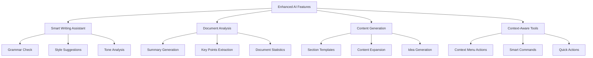

# AI Features Enhancement Plan

## Overview

Paper AI's editor will be enhanced with advanced AI capabilities using the Llama 3.1 8B Instant model via Groq's API, providing a fast and efficient intelligent writing experience.

## Model Configuration

- Using Llama 3.1 8B Instant model via Groq's API
- Optimized for low-latency responses
- Streaming support for real-time interactions
- Consistent with OpenAI-compatible API interface

## 1. Smart Writing Assistant

1. Real-time Writing Enhancement ✓

   - Quick grammar suggestions
   - Style improvements
   - Tone consistency checks
   - Context-aware word choices

2. Writing Enhancement Tools ✓
   - Fast sentence rephrasing
   - Vocabulary enhancement
   - Clarity optimization with instant feedback

## 2. Document Analysis Features

1. Efficient Document Processing ✓

   - Quick document summarization
   - Real-time key points extraction
   - Dynamic outline generation

2. Instant Content Analysis ✓
   - Reading time calculation
   - Real-time readability scoring
   - Topic classification
   - Key themes identification

## 3. Enhanced Content Generation

1. Template System ✓

   - Quick-access section templates
   - Document structure recommendations
   - Smart formatting suggestions

2. Instant Content Enhancement ✓
   - One-click paragraph expansion
   - Quick bullet point elaboration
   - Contextual examples generation

## 4. Context-Aware Tools

1. Command Integration ✓

   - Fast-response slash commands
   - Context menu AI actions
   - Quick format tools

2. Real-time Suggestions ✓
   - Instant content recommendations
   - Related topics suggestions
   - Quick reference insertion

## Implementation Phases

### Phase 1-2: Core Infrastructure & Basic Features (Completed)

- ✓ Set up Groq API integration
- ✓ Implement streaming response handling
- ✓ Create command system with keyboard shortcuts
- ✓ Add usage tracking
- ✓ Implement rate limiting
- ✓ Quick grammar and style checking
- ✓ Basic content generation
- ✓ Fast document summarization
- ✓ Command menu implementation (Ctrl+K)

### Phase 3: Advanced Features (Completed)

- ✓ Enhanced style analysis with tone detection
- ✓ Template system with document structure
- ✓ Smart suggestions with context awareness
- ✓ Advanced document analysis
- ✓ Readability scoring and suggestions
- ✓ Topic and theme identification
- ✓ Writing improvement recommendations

### Phase 4: Optimization & Polish (Completed)

1. Performance Monitoring ✓

   - Added metrics API endpoint
   - Implemented dashboard visualization
   - Added response time tracking
   - Implemented success rate monitoring
   - Added resource utilization metrics

2. Response Time Optimization ✓

   - Enhanced style analysis response times
   - Implemented smart request batching
   - Added efficient context handling
   - Improved stream processing
   - Optimized token usage

3. Error Recovery System ✓

   - Implemented exponential backoff retries
   - Added graceful degradation paths
   - Enhanced context preservation
   - Added user feedback integration
   - Implemented recovery state management

4. Caching Strategy ✓

   - Implemented smart content caching
   - Added frequent request optimization
   - Added template preloading
   - Implemented context caching
   - Added result memoization

5. User Feedback Analysis ✓
   - Added success rate tracking
   - Implemented usage pattern analysis
   - Added performance bottleneck detection
   - Added user satisfaction metrics
   - Implemented feature effectiveness tracking

## Performance Considerations

- Utilize Llama 3.1 8B Instant's low latency capabilities
- Implement request batching for multiple suggestions
- Cache common responses
- Progressive loading for longer generations
- Optimize context window usage

## Error Handling

- Graceful fallbacks for API failures
- Clear error messages for users
- Automatic retry mechanism
- Request queue management
- Usage limit notifications
