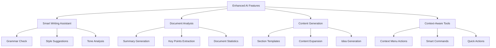
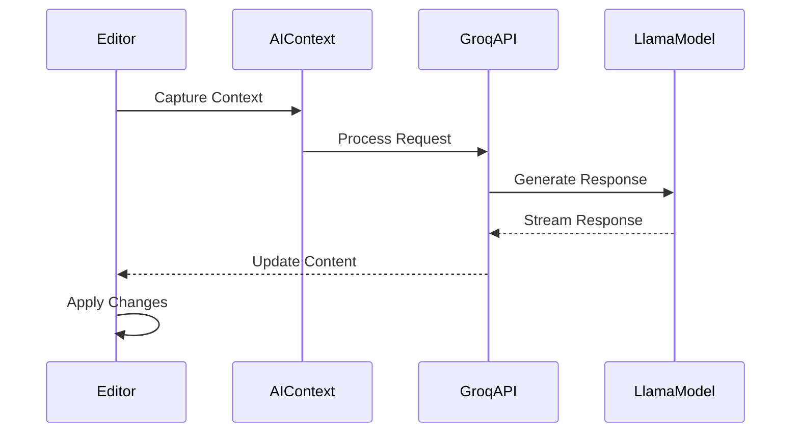

# AI Features Enhancement Plan

## Overview

Paper AI's editor will be enhanced with advanced AI capabilities using the Llama 3.1 8B Instant model via Groq's API, providing a fast and efficient intelligent writing experience.



## Model Configuration

- Using Llama 3.1 8B Instant model via Groq's API
- Optimized for low-latency responses
- Streaming support for real-time interactions
- Consistent with OpenAI-compatible API interface

## 1. Smart Writing Assistant

1. Real-time Writing Enhancement

   - Quick grammar suggestions
   - Style improvements
   - Tone consistency checks
   - Context-aware word choices

2. Writing Enhancement Tools
   - Fast sentence rephrasing
   - Vocabulary enhancement
   - Clarity optimization with instant feedback

## 2. Document Analysis Features

1. Efficient Document Processing

   - Quick document summarization
   - Real-time key points extraction
   - Dynamic outline generation

2. Instant Content Analysis
   - Reading time calculation
   - Real-time readability scoring
   - Topic classification
   - Key themes identification

## 3. Enhanced Content Generation

1. Template System

   - Quick-access section templates
   - Document structure recommendations
   - Smart formatting suggestions

2. Instant Content Enhancement
   - One-click paragraph expansion
   - Quick bullet point elaboration
   - Contextual examples generation

## 4. Context-Aware Tools

1. Command Integration

   - Fast-response slash commands
   - Context menu AI actions
   - Quick format tools

2. Real-time Suggestions
   - Instant content recommendations
   - Related topics suggestions
   - Quick reference insertion

## Technical Implementation



### Architecture Components

1. AI Context Provider

```typescript
interface AIContextState {
  documentType: string;
  currentSection: string;
  selectedText: string;
  history: AIAction[];
  modelConfig: {
    temperature: number;
    maxTokens: number;
    topP: number;
  };
}
```

2. Enhanced Command System

```typescript
interface AICommand {
  name: string;
  description: string;
  action: (context: AIContextState) => Promise<void>;
  shortcut?: string;
  responseType: "stream" | "single";
}
```

3. Rate Limiting and Usage Tracking

```typescript
interface UsageMetrics {
  userId: string;
  requestCount: number;
  tokensUsed: number;
  timestamp: Date;
  modelType: string;
}
```

## Implementation Phases

### Phase 1: Core Infrastructure (Week 1-2)

- Set up Groq API integration
- Implement streaming response handling
- Create basic command system
- Add usage tracking
- Implement rate limiting

### Phase 2: Basic Features (Week 2-3)

- Quick grammar and style checking
- Basic content generation
- Fast document summarization
- Command menu implementation

### Phase 3: Advanced Features (Week 3-4)

- Enhanced style analysis
- Template system
- Smart suggestions
- Advanced document analysis

### Phase 4: Optimization (Week 4-5)

- Response time optimization
- User feedback collection
- Feature refinement
- Error handling improvements
- Performance monitoring

## Performance Considerations

- Utilize Llama 3.1 8B Instant's low latency capabilities
- Implement request batching for multiple suggestions
- Cache common responses
- Progressive loading for longer generations
- Optimize context window usage

## Error Handling

- Graceful fallbacks for API failures
- Clear error messages for users
- Automatic retry mechanism
- Request queue management
- Usage limit notifications
