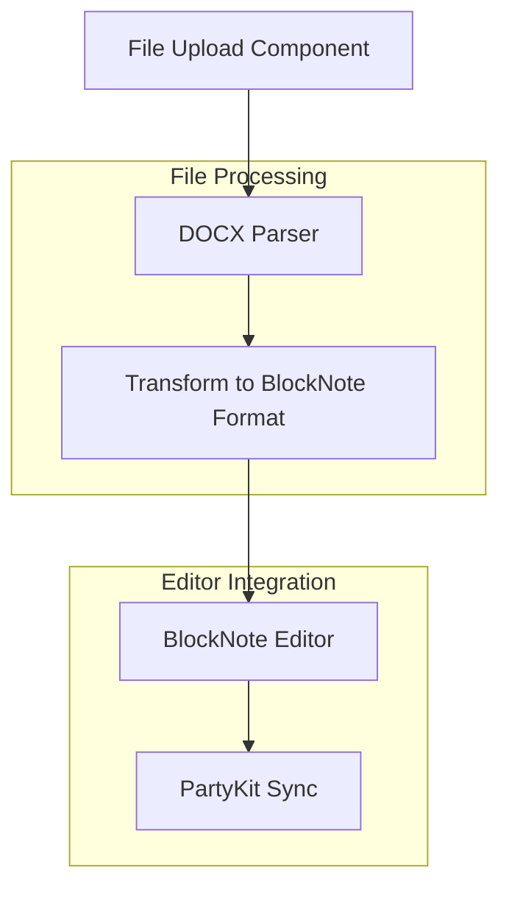
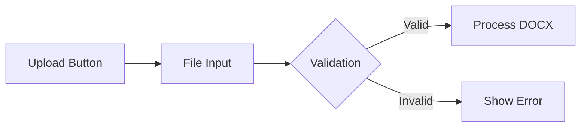
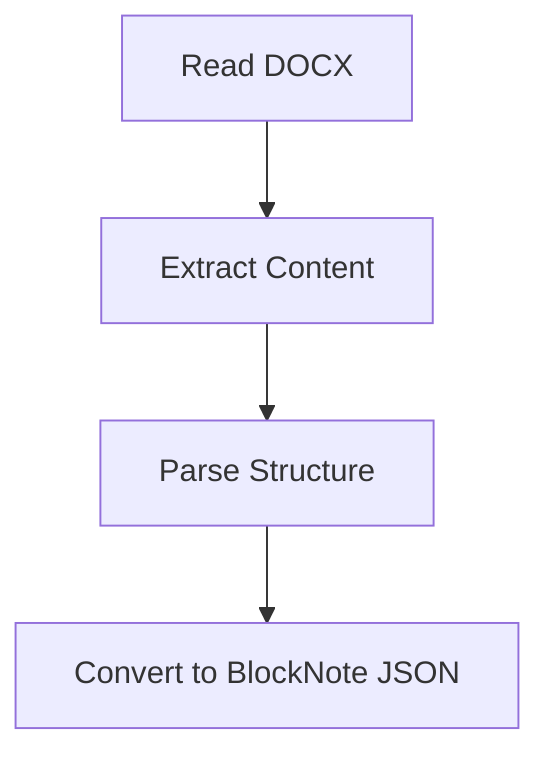
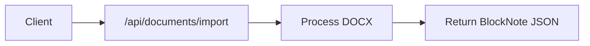
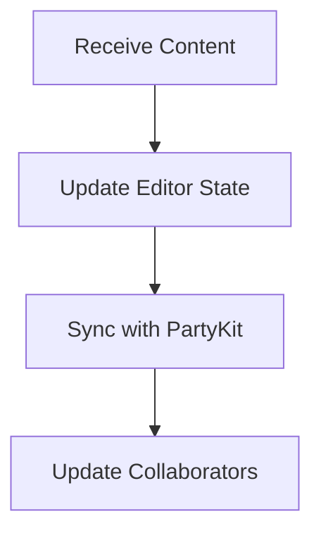

# DOCX Import Feature Plan

## Overview

This document outlines the implementation plan for adding DOCX file import functionality to the Paper AI editor, maintaining compatibility with BlockNote and PartyKit integration.

## Architecture

## Implementation Components

### 1. File Upload Component

- Add upload button in EditorHeader component
- Handle file selection and validation
- Support drag-and-drop functionality
- Show loading state during processing

### 2. DOCX Processing Service

- Use mammoth.js for DOCX parsing
- Extract text content and formatting
- Handle images and tables
- Convert to BlockNote-compatible format

### 3. API Integration

- Create new API endpoint for DOCX processing
- Handle file upload with proper size limits
- Process file server-side for better performance
- Return formatted content for editor

### 4. Editor Integration

- Integrate with existing BlockNote editor
- Update Y.js document with new content
- Maintain real-time collaboration during import
- Handle import progress states

## Technical Considerations

### Dependencies

- mammoth.js for DOCX processing
- Configure proper file upload handling in Next.js
- Update necessary types for BlockNote integration

### Security

- File size limits and validation
- File type verification
- Sanitize imported content
- Handle user permissions

### Performance

- Server-side processing for large files
- Chunked processing for better memory usage
- Optimized editor state updates
- Progress indicators for better UX

### Error Handling

- Invalid file format errors
- Processing failures
- Network issues
- Permission errors
