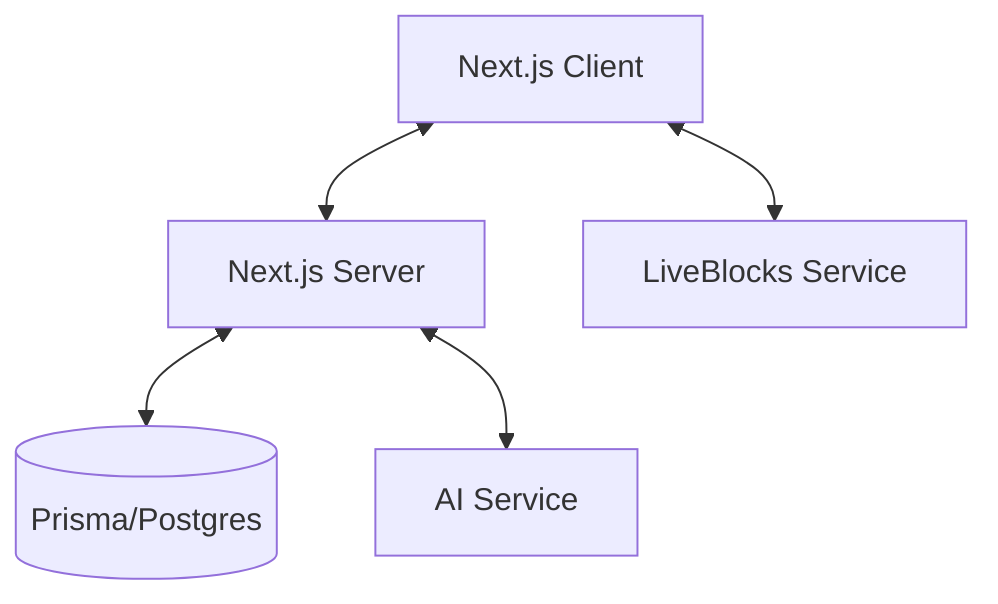

# System Patterns

## Architecture Overview

Paper AI follows a modern full-stack architecture:



## Design Patterns

### Authentication

- JWT-based authentication
- Server-side session management
- Protected API routes
- Middleware-based route protection

### Real-time Collaboration

- LiveBlocks for real-time sync
- Room-based collaboration model
- Presence awareness system
- Conflict resolution handling

### Editor Implementation

- TipTap for rich text editing
- LiveBlocks integration for real-time sync
- Collaborative editing features
- Extensible command system

### State Management

- Zustand for client-state
- Server-side state with Prisma
- Real-time state sync with LiveBlocks
- Optimistic updates for better UX

### Component Architecture

- Atomic design principles
- Shadcn UI component system
- Custom components for specific features
- Reusable UI patterns

## Data Flow

1. User Authentication

   ```
   Client -> API -> Database
   ```

2. Room Collaboration

   ```
   Client <-> LiveBlocks <-> Other Clients
   ```

3. AI Integration
   ```
   Client -> API -> AI Service -> Client
   ```

## Key Technical Decisions

1. Next.js App Router for routing
2. Prisma with Postgres for data layer
3. LiveBlocks for real-time features
4. TipTap with LiveBlocks for editor
5. Tailwind CSS for styling
6. TypeScript for type safety
7. Shadcn UI for component base
