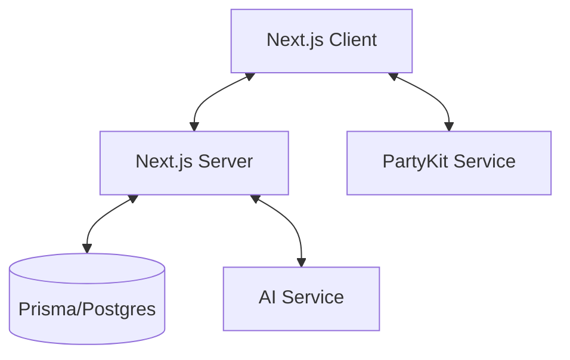

# System Patterns

## Architecture Overview

Paper AI follows a modern full-stack architecture:



## Design Patterns

### Authentication

- Better Auth library integration
- JWT-based authentication
- Server-side session management
- Protected API routes
- Middleware-based route protection

### Data Management

- React Query for server state
- Cache invalidation patterns
- Optimistic updates
- Real-time data synchronization

### Real-time Collaboration

- PartyKit for real-time sync
- Room-based collaboration model with document-specific rooms
- Presence awareness system:
  - Live collaborator avatars in document header
  - Static store pattern for cross-instance state
  - Automatic user join/leave handling
  - Visual indicators for current user (green dot)
  - Fallback avatars and tooltips
- Connection state management:
  - Automatic cleanup on disconnect
  - User session tracking
  - Real-time presence broadcasts
- Conflict resolution handling

### Editor Implementation

- BlockNote for rich text editing
- PartyKit integration for real-time sync
- Collaborative editing features
- Extensible command system

### State Management

- Zustand for client-state
- React Query for server-state
- Real-time state sync with PartyKit
- Optimistic updates for better UX

### Component Architecture

- Atomic design principles
- Shadcn UI component system
- Custom components for specific features
- Reusable UI patterns

## Data Flow

1. User Authentication

   ```
   Client -> Better Auth -> API -> Database
   ```

2. Room Collaboration

   ```
   Client <-> PartyKit <-> Other Clients
   ```

3. Data Fetching

   ```
   Client -> React Query -> API -> Database
   ```

4. AI Integration
   ```
   Client -> API -> AI Service -> Client
   ```

## Key Technical Decisions

1. Next.js App Router for routing
2. Prisma with Postgres for data layer
3. PartyKit for real-time features
4. BlockNote with PartyKit for editor
5. React Query for data fetching
6. Better Auth for authentication
7. Tailwind CSS for styling
8. TypeScript for type safety
9. Shadcn UI for component base
